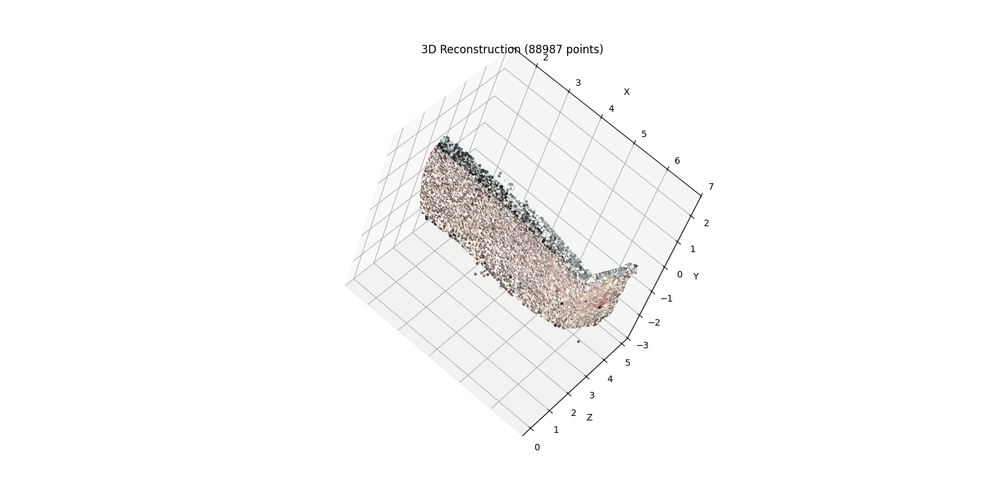

## Project Overview

This project implements an Incremental Structure from Motion (SfM) pipeline in Python. It takes a sequence of 2D images of a bricked wall and reconstructs a sparse 3D point cloud of the scene.
The pipeline utilizes SIFT features for matching, solves the PnP problem to register new cameras, performs triangulation to generate 3D points and optimizes the reconstruction using Bundle Adjustment.

## Key Features

1. Feature Extraction: SIFT is used to detect keypoints and descriptors.
2. Geometric Verification: Matches are filtered using Homography (for planar surfaces) and Fundamental Matrix (for non-planar) checks.
3. Initialization: The reconstruction is seeded using an initial pair of frames (Frame 0 and Frame 2).
4. Incremental Reconstruction: New frames are added one by one via PnP and triangulation.
5. Optimization: Bundle Adjustment is applied periodically to minimize reprojection error.

## Code Description

1. main.py: The core pipeline. It handles the initialization using the Essential Matrix, loops through the dataset to register new frames using PnP, manages the 3D point cloud growth via triangulation and triggers Bundle Adjustment.
2. dataset_loader.py: Loads the image dataset. It implements a natural sort algorithm to ensure that frames are processed in the correct numerical order.
3. feature_utils.py: Implements detect_and_compute using OpenCV's SIFT. It extracts keypoints and descriptors from the input images.
4. matching_utils.py: Handles feature matching using BFMatcher. It applies Lowe’s Ratio Test to ensure only high-quality feature matches are kept.
5. pnp_utils.py: Contains estimate_camera_pose. This uses cv2.solvePnPRansac to determine the position of a new camera relative to the existing 3D point cloud.
6. triangulation_utils.py: Converts matched 2D points from two camera views into a 3D point using cv2.triangulatePoints. It includes checks to remove points behind the camera or too far away.
7. bundle_adjustment.py: Refines the camera poses and 3D point positions. It constructs a sparse Jacobian matrix and uses scipy.optimize.least_squares to minimize the reprojection error.
8. remove_outliers.py: A post-processing script. The raw output from the pipeline (reconstruction_result.ply) contains floating noise. This script filters points based on coordinate bounds and statistical distances, saving the cleaned result as reconstruction_clean.ply.
9. plot_3d.py: A visualization utility using Matplotlib. It plots the 3D point cloud with RGB colors and includes an internal filter to hide extreme statistical outliers during the interactive display.

## Results

 3D plot made using matplotlib
 

 Visualisation on CloudCompare
 

 ## Installation and Usage

1. Install Dependencies: pip install numpy opencv-python scipy matplotlib
2. Run the Reconstruction: python main.py
   
Output: reconstruction_result.ply and a 3D plot of the cloud

3. Clean Outliers: python remove_outliers.py
   
Output: reconstruction_clean.ply

## Viewing the Point Cloud

1. Specific Binary File: A file named point_cloud.bin is included in this repository. It can be opened directly in CloudCompare to rotate, zoom and inspect the structure in detail.

   OR
   
2. PLY Files: You can also import the generated reconstruction_clean.ply.
